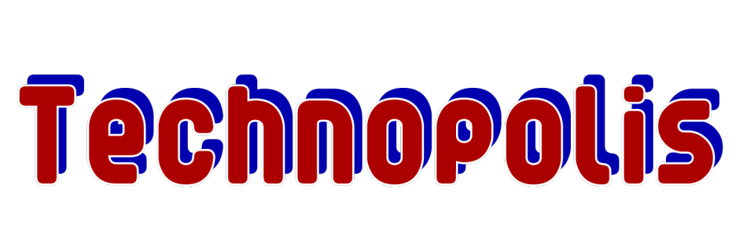

= 
銀猫さん <silverscat_3@mail.sc3.fun>

Technopolis is a globally interconnected micro-blogging platform inspired by Misskey.

It was developed to replace Misskey’s cumbersome web API and make it more robust.

== TO DO and NOT TO DO list

We are going to implement all of Misskey's features, but we are not going to implement some unnecessary features.

=== TO DO

Emoji reaction:: 
Emoji reaction is the primary reason to use misskey. Of course, Technopolis will implement it.
File drive:: This is a useful feature for illustrators and others who want to re-submit images that have been posted in the past. It may be simpler than Misskey.
Custom timeline:: A powerful custom timeline that allows you to narrow down your posts with regular expressions.
AsciiDoc:: AsciiDoc boasts Markdown-like readability and more powerful expressiveness than Markdown.

=== NOT TO DO

Reversi:: Is this _**REALLY**_ necessary? Is there a reason why the preinstalled solitaire or pinball on Windows isn't good enough?
Live stream:: This feature is only available in misskey.io, not in misskey.
Chat:: (Maybe I'll implement it.) See https://github.com/technopolis-microblog/Technopolis/issues/11[this issue.]
Static page:: Isn't github.io or Netlify enough?
Misskey Flavored Markdown:: The letters rotate and jump... the marquee tag is obsolete, isn't it?
Misskey Room:: Why was this implemented in Misskey?

== Requirement

== Installation

== License

Licensed under the GNU Affero General Public License, Version 3(link:./LICENSE[LICENSE] or https://opensource.org/licenses/agpl-3.0)

== Author

Copyright (c) 2020 Technopolis Developers.
